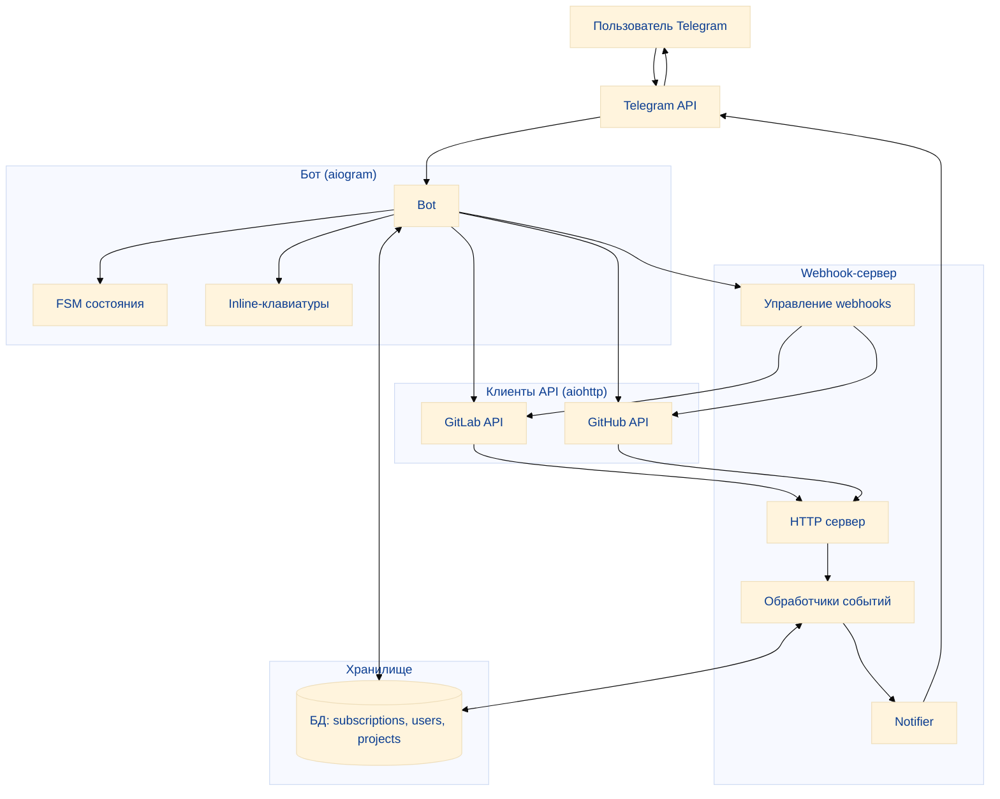

# GitLab Assistant 

Пользовательсоке описание Telegram-бота для отслеживания событий в GitLab и GitHub проектах

## Возможности

- Уведомления о статусе CI/CD пайплайнов
- Упоминания в Merge Requests / Pull Requests
- Назначение ревьюверов
- Обновления документации и Wiki
- Поддержка GitLab и GitHub
- Гибкая настройка подписок
- Безопасное хранение токенов

## Архитектура

```
gitlab-assistant/
├── src/                          # Исходный код
│   ├── bot/                      # Telegram бот
│   │   ├── bot.py               # Главный файл бота
│   │   ├── handlers.py          # Базовые обработчики команд
│   │   ├── subscription_handlers.py  # Обработчики подписок
│   │   ├── keyboards.py         # Inline клавиатуры
│   │   └── states.py            # FSM состояния
│   ├── database/                 # База данных
│   │   ├── models.py            # SQLAlchemy модели
│   │   └── database.py          # Работа с БД
│   ├── gitlab_api/               # GitLab API
│   │   └── client.py            # Асинхронный клиент
│   ├── github_api/               # GitHub API
│   │   └── client.py            # Асинхронный клиент
│   ├── webhook/                  # Webhook сервер
│   │   ├── server.py            # HTTP сервер
│   │   ├── handlers.py          # Обработчики событий
│   │   ├── notifier.py          # Отправка уведомлений
│   │   └── manager.py           # Управление webhooks
│   └── config.py                 # Конфигурация
├── tests/                        # Тесты
│   └── test_webhook.py           # Тесты обработчиков
├── main.py                       # Точка входа
├── requirements.txt              # Python зависимости, то что нужно предустановить
├── .gitignore                    # Git ignore
└── docs/                         # Документация, README
```




##  Использование бота

### Основные команды

- `/start` — Начало работы с ботом
- `/help` — Справка по командам
- `/status` — Текущий статус и подписки
- `/subscribe` — Подписка на проекты GitLab/GitHub
- `/unsubscribe` — Отписка от проектов
- `/list_subscriptions` — Все активные подписки
- `/set_gitlab_token` — Установка GitLab токена
- `/set_github_token` — Установка GitHub токена
PS. оба токены должны быть созданы пользователем так, чтобы был полный доступ к API и репозиторию (Lab) / уведомлениям (Hub)
- `/notifications`  выбрать, какие будут приходить уведомления/упоминания из описанных выше (здесь будут реализованы кнопки с разными вариантами выбора подписок и отменой)

### Подробнее про подписки и уведомления:
**Finite State Machine:** Для управления интерактивными диалогами подписки и отписки будет внедрена система состояний (FSM) с использованием `aiogram.fsm`
- **Состояния:** Созданы две группы состояний:
      - `SubscriptionStates` — для процесса подписки (выбор платформы, проекта, событий, подтверждение).
      - `UnsubscriptionStates` — для процесса отписки (выбор подписки, подтверждение).
- **Хранилище состояний:** В качестве хранилища используется `MemoryStorage`, что идеально подходит для разработки и тестирования.

**`/subscribe`:** Будет запускать пошаговый процесс подписки:
  1. **Выбор платформы:** Бот предлагает выбрать GitLab или GitHub с помощью inline-клавиатуры
  2. **Выбор проекта:** После выбора платформы бот запрашивает список проектов пользователя и отображает их в виде пагинированной inline-клавиатуры.
  3. **Выбор событий:** Пользователь может выбрать интересующие его события (pipelines, merge requests и т.д.) с помощью интерактивной клавиатуры.
  4. **Подтверждение:** Бот выводит сводную информацию и запрашивает подтверждение.
  5. **Создание/обновление подписки:** В базе данных создается новая или обновляется существующая подписка.
 
**`/unsubscribe`:**  Команда для отписки от проектов, дублирует функционал подписки, но в конце подписка удаляется из базы данных.

 **`/cancel`:** В любой момент процесса пользователь может нажать кнопку "Отмена", чтобы прервать операцию.


### Интеграция с API 
- Получение списка проектов
- Управление webhooks
- Получение информации о MR, pipelines, issues и PR, workflows, issues для GitLab/GitHub
- Асинхронные запросы

### Webhook-сервер
Необходим для того, чтобы ловить события из git систем и пересылать их дальше в нужном нам виде и только тем, кто на них подписан
GitLab/GitHub → webhook-сервер → Telegram

### FSM (Finite State Machine) для пошагового сценария подписки

| Команда/Сценарий | Модуль | Описание |
| :--- | :--- | :--- |
| `/start` | `src/bot/handlers.py` | Регистрация пользователя в БД. |
| `/status` | `src/bot/handlers.py` | Отображение текущих токенов и подписок. |
| `/set_gitlab_token`, `/set_github_token` | `src/bot/handlers.py` | Валидация токена через API и сохранение в БД. |
| `/subscribe` | `src/bot/subscription_handlers.py` | Пошаговый сценарий выбора платформы, проекта, событий и подтверждения. |
| `/unsubscribe` | `src/bot/subscription_handlers.py` | Сценарий отписки от проекта. |


**Возможности:**
- Прием событий от GitLab и GitHub
- Обработка различных типов событий
- Фильтрация по подпискам
- Форматирование уведомлений
- Health check endpoint

### Типы событий, которые поддерживает этот самостоятельный HTTP-сервер (webhook)

### GitLab

| Событие | Описание | Состояние                |
|---------|----------|--------------------------|
|  Pipeline | Изменения статуса CI/CD пайплайнов | success, failed, running |
|  Merge Request | События в merge requests | opened, merged, closed   |
|  Issue | События в issues | opened, closed, updated  |
|  Wiki | Обновления wiki | created, updated         |
|  Комментарии | Новые комментарии | Note, Comment            |

### GitHub

| Событие | Описание | Состояние        |
|-------|----------|------------------|
|  Workflow | Изменения в GitHub Actions | success, failure |
| Pull Request | События в pull requests | opened, merged, closed|
| Issue | События в issues | opened, closed |
| Комментарии | Новые комментарии | issue, PR |

---

## Итоги:

Структура модулей

| Модуль | Код | Описание |
| :--- | :--- | :--- |
| **Бот** | `src/bot/` | Содержит логику Telegram-бота: обработчики команд (`handlers.py`), сценарии подписки (`subscription_handlers.py`), клавиатуры (`keyboards.py`). |
| **Webhook** | `src/webhook/` | Содержит логику приема и обработки Webhooks: HTTP-сервер (`server.py`), общий роутинг (`handlers.py`), персонализированная логика фильтрации (`personalized_handlers.py`), отправка уведомлений (`notifier.py`). |
| **База данных** | `src/database/` | Модели данных (`models.py`), асинхронное управление сессиями (`database.py`). |
| **API Клиенты** | `src/gitlab_api/`, `src/github_api/` | Асинхронные клиенты для взаимодействия с внешними API. |
| **Конфигурация** | `src/config.py` | Загрузка настроек из переменных окружения. |


### Принцип работы

1.  **Регистрация и Подписка:** Пользователь регистрируется в боте и проходит сценарий подписки (`/subscribe`), где указывает платформу, проект и типы событий. Бот сохраняет подписку в БД.
2.  **Настройка Webhook:** При успешной подписке бот использует API-токен пользователя для **автоматической настройки Webhook** на стороне GitLab/GitHub, указывая адрес своего Webhook-сервера.
3.  **Прием События:** При возникновении события (например, новый комментарий) GitLab/GitHub отправляет HTTP-запрос (Webhook) на **Webhook Сервер** бота.
4.  **Обработка и Фильтрация:** Webhook Сервер принимает запрос, передает его в `src/webhook/handlers.py`, который, в свою очередь, вызывает **персонализированные обработчики** (`personalized_handlers.py`). Эти обработчики:
    *   Извлекают данные о событии (автор, ревьюер, упоминания).
    *   Ищут в БД пользователей, подписанных на данный проект.
    *   Фильтруют события, оставляя только те, которые касаются конкретного пользователя (например, если его упомянули или назначили ревьюером).
5.  **Отправка Уведомления:** Для каждого отфильтрованного события формируется сообщение и передается в `src/webhook/notifier.py`, который использует экземпляр Telegram-бота для отправки **персонализированного уведомления** пользователю.

