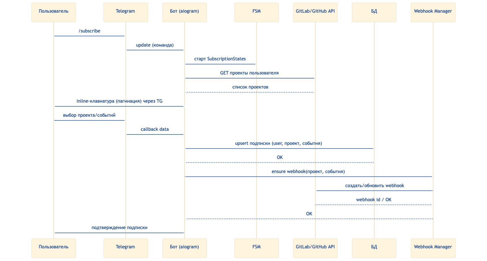

# GitLab Assistant

## Обзор проекта

**Описание:** Разработка Telegram-бота-ассистента для разработчиков, работающих с GitLab/GitHub. Бот уведомляет о важных событиях в проектах и репозиториях, таких как изменения статусов CI/CD пайплайнов, упоминания в merge request'ах, назначение ревьюверов, обновления важной документации и упоминания разработчиков в wiki. Опционально — управление пайплайнами и merge request'ами через бота.  

## Порядок действий

### Этап 0: Анализ требований и проектирование

 **Сбор основных требований к проекту:**
   * Обсуждение функционала проекта с составителем, а именно необхоимо определить:
    1. ключевые события для уведомлений и приоритетов
    2. возможности бота и основные команды
**Проектирование архитектуры:**
   * Определение основных компонентов, задействованных в реализации, :
    1.  Документация 
    2.  Telegram-бот
    3.  Сервис уведомлений
    4.  База данных для хранение пользователей, подписок и истории уведомлений
    5.  Тестирование
    6.  Логирование
    7.  GitLab/GitHub API взаимодействие
    8.  Обработка входящих событий (Webhook)

### Этап 1: Разработка базового функционала Telegram-бота

1. **Инициализация проекта:**  
   * Создание репозитория, настройка окружения и зависимостей  
2. **Реализация основных команд бота:**  
   * /start, /help, авторизация пользователя
3. **Интеграция с Telegram Bot API:**  
   * Получение и отправка сообщений  
4. **Тестирование базового взаимодействия:**  
   * Проверка корректности работы команд и ответов  

### Этап 2: Интеграция с GitLab/GitHub API для получения уведомлений 

1. **Изучение API GitLab и GitHub:**  
   * Определение доступных webhook’ов и методов API для получения событий  
2. **Настройка webhook-подписок:**  
   * Создание и регистрация webhook’ов для нужных событий в репозиториях  
3. **Обработка входящих событий:**  
   * Разработка механизма получения и парсинга webhook-сообщений  
4. **Отправка уведомлений в Telegram:**  
   * Формирование информативных сообщений и их отправка пользователям  

### Этап 3: Расширение функционала уведомлений и управление

1. **Добавление поддержки новых типов событий:**  
   * Упоминания в MR, назначение ревьюверов, обновления документации и wiki  
2. **Реализация команд управления:**  
   * Возможность запускать/останавливать пайплайны, принимать/отклонять MR через бота  
3. **Механизмы аутентификации и авторизации:**  
   * Безопасный доступ к функциям управления  
4. **Настройка пользовательских фильтров уведомлений:**  
   * Возможность выбирать, какие события получать  
  
### Этап 4: Тестирование и отладка

1. **Написание модульных тестов:**
	* Проверка ключевых компонентов и функций
2. **Интеграционное тестирование:**
	* Проверка взаимодействия между ботом, API и базой данных
3. **Тестирование пользовательского сценария:**
   * Проверка корректности уведомлений и команд управления
4. **Исправление багов и оптимизация:**
	* Улучшение производительности и стабильности

### Модели базы данных
Будут реализованы три основные модели:
**User** — пользователи Telegram:
- Telegram ID (уникальный идентификатор)
- Имя, фамилия, username
- Токены доступа к GitLab и GitHub (зашифрованное хранение)
- Статус активности
- Временные метки создания и обновления

**Subscription** — подписки на события:
- Связь с пользователем
- Платформа (GitLab или GitHub)
- ID и название проекта
- Типы отслеживаемых событий
- Статус активности

**Notification** — история уведомлений:
- Связь с пользователем
- Тип события и платформа
- Текст сообщения
- Метаданные в JSON формате
- Временная метка отправки

## Технологический стек

| Категория           | Технология          | Описание                                                                                     |
|---------------------|---------------------|----------------------------------------------------------------------------------------------|
| Язык программирования| Python              | Язык разработки бота                                                               |
| API взаимодействия   | HTTP/REST API       | Взаимодействие с GitLab/GitHub API и Telegram Bot API                                       |
| Библиотеки Telegram  | python-telegram-bot / aiogram | Для реализации функционала Telegram-бота                                                    |
| Асинхронность       | asyncio / aiohttp    | Для эффективной работы с HTTP запросами и API                                               |
| СУБД                 | SQLite / PostgreSQL  | Для хранения настроек пользователя, токенов, истории уведомлений и подобное                     |
| ORM | SQLAlchemy (async) | ORM с поддержкой асинхронности |
| Хранение конфигураций| pydantic-settings | Для управления настройками и ключами                                                        |
| Тестирование         | pytest              | Для написания модульных и интеграционных тестов                                             |
| CI/CD               | GitLab CI / GitHub Actions | Для автоматизации сборки, тестирования и деплоя                                             |
| Логирование | loguru | Удобное и мощное логирование для мониторинга и отладки|

##  Ресурсы
* **Мониторинг событий Gitlab**
https://docs.gitlab.com/user/project/integrations/webhook_events/
* **GitLab API Documentation:** https://docs.gitlab.com/ee/api/  
* **GitHub API Documentation:** https://docs.github.com/en/rest  
* **Telegram Bot API:** https://core.telegram.org/bots/api  
* **python-telegram-bot:** https://github.com/python-telegram-bot/python-telegram-bot  
* **aiogram:** https://docs.aiogram.dev/en/latest/ 
* **pytest:** https://docs.pytest.org/en/stable/  
* **GitLab CI/CD:** https://docs.gitlab.com/ee/ci/  
* **GitHub Actions:** https://docs.github.com/en/actions  

---
